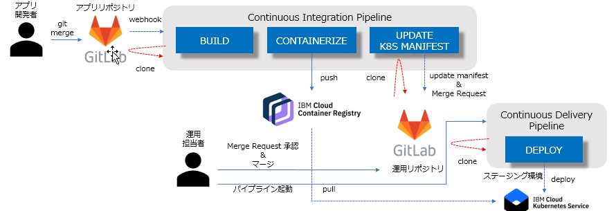

#  Kubernetesアプリのステージング環境用ツールチェーン

### KubernetesアプリのIKSクラスターへのGitOpsによる継続的デリバリーツールチェーン
このカスタムツールチェーンを利用することによりKubernetesアプリ開発のGitOpsツールチェーンを迅速に構築することが可能です。

アプリのコードをIBM Cloud Gitに保管し、Dockerfileも同様に配置してください。

ツールチェーンの作成時にIBM Cloud Gitのリポジトリやアプリのデプロイ対象クラスターの情報を入力することでGitから取得したコードをコンテナ・イメージにビルドし、対象のクラスターにデプロイするパイプラインが自動的に構成されます。

ステージング環境においてはアプリのGitリポジトリのreleaseブランチにコードがCommitされると自動的にビルドが実行されます。

ビルドが実行されるとインフラのリポジトリにあるマニフェストファイルが自動的に更新され、マージリクエストが作成されます。

マージリクエストから変更内容を確認したあとでマージを実行し、その後でデプロイのパイプラインを手動で起動することでデプロイすることが可能です。

### ツールチェーン作成は以下のボタンから！:

このツールチェーンでは以下のベストプラクティスを実装しています:
- GitOpsプラクティスに対応したバージョン管理とDelivery Pipeline
- コンテナ・イメージビルド前のDockerfileの妥当性チェック
- GitのCommitごとのコンテナ・イメージとビルド番号ベースのタグ設定による追跡可能性の確保
- コンテナ・イメージのレジストリーへの保管
- APIトークンを利用したデプロイ対象クラスターへのアクセス権限の自動構成
- コンテナ・イメージのセキュリティ脆弱性のチェック
- GitOpsプラクティスに則った最新ビルドイメージタグのマニフェストファイルへの自動反映
- デプロイ対象名前空間の自動生成

---
### Learn more

* Blog [Continuously deliver your app to Kubernetes with Bluemix](https://www.ibm.com/blogs/cloud-archive/2017/07/continuously-deliver-your-app-to-kubernetes-with-bluemix/)
* Step by step [tutorial](https://www.ibm.com/cloud/architecture/tutorials/use-develop-kubernetes-app-toolchain)
* [Getting started with clusters](https://cloud.ibm.com/docs/containers?topic=containers-getting-started)
* [Getting started with toolchains](https://cloud.ibm.com/devops/getting-started)
* [Documentation](https://cloud.ibm.com/docs/services/ContinuousDelivery?topic=ContinuousDelivery-getting-started&pos=2)
